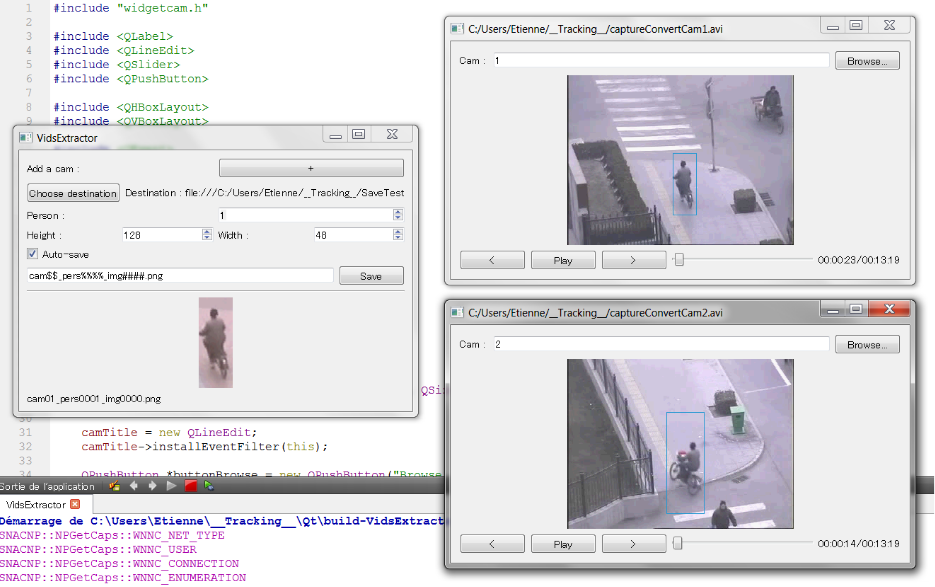

# ClickAndCrop

A simple program that I developed two years ago while I was in a research laboratory. Its goal was to assist me during the dataset creation process where I had to extract and crop persons from a video. I know that the dataset labeling task can be tiresome so I release the code in case someone found it and find it useful. The program is declined in two versions for both single and multi-camera.



Even if the program is really simple, I also wrote a small [Manuel](VidExtractor_Manual.pdf) back then to detail some functionalities ([multi-camera version](VidsExtractor_Manual.pdf)).

The program require Qt (tested with 5.3) and OpenCv (tested with 2.4.9) To compile the program, simply run:

```
cd VidExtractor/
qmake
make
```

Just be careful to use the `qmake` associated with qt5. For the multi-camera version, use the same commands on the `VidsExtractor/` folder.
